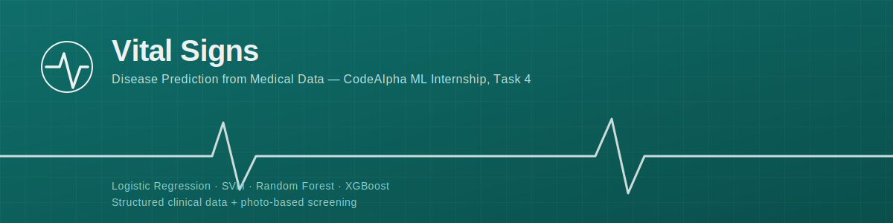
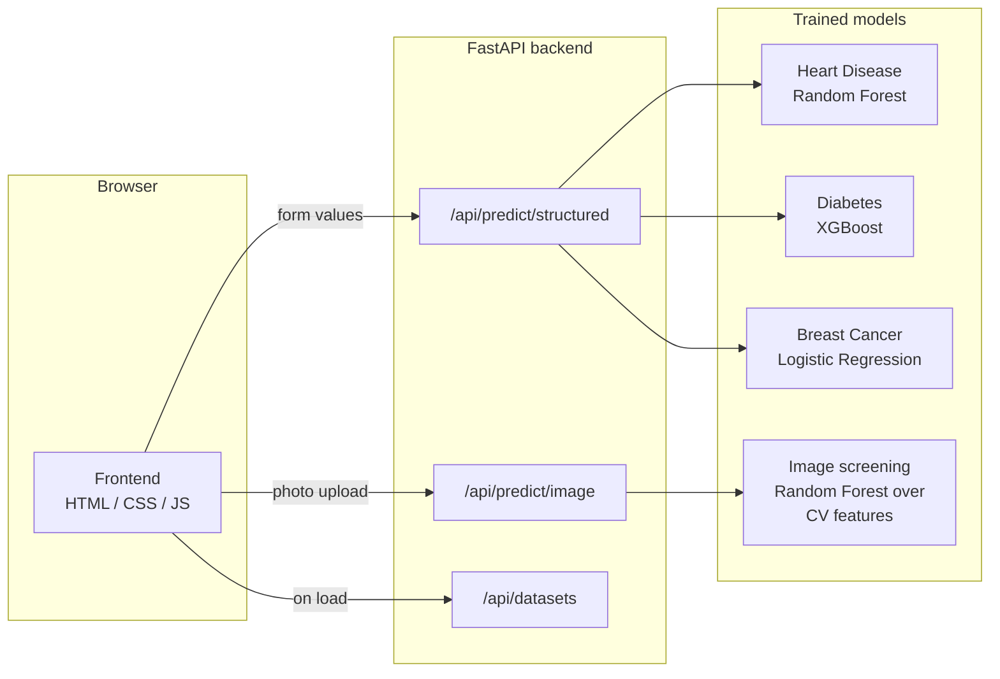

<div align="center">
  

  <br/>

  
  
  
  
  
</div>

# Vital Signs — Disease Prediction from Medical Data

**CodeAlpha Machine Learning Internship — Task 4.**
A browser-based screening tool that predicts disease risk two ways:

1. **Structured clinical data** — enter symptoms, vitals, and lab values; a trained classifier
   returns a probability of disease.
2. **Photo screening** *(added capability)* — upload a photo of a visible finding (e.g. a skin
   mark); a computer-vision pipeline flags whether it looks regular or irregular.

> ⚠️ **This is a portfolio / educational project, not a medical device.** Nothing here should
> inform a real health decision. See [Limitations & ethics](#limitations--ethics) below.

---

## Live features

| Mode | Input | Model | Datasets |
|---|---|---|---|
| Structured data | Age, symptoms, blood-test values, etc. | Best of Logistic Regression / SVM / Random Forest / XGBoost, auto-selected per dataset | Heart Disease (UCI Cleveland), Diabetes (Pima Indians), Breast Cancer (UCI Wisconsin) |
| Photo screening | A patient photo (skin finding) | Random Forest over classical CV features | ABCD-rule feature pipeline (see below) |

## Model performance

Each dataset is evaluated on a held-out 20% test split; the highest ROC-AUC model is the one
that actually serves predictions.

| Dataset | Best model | Accuracy | F1 | ROC-AUC |
|---|---|---|---|---|
| Heart Disease | Random Forest | 0.820 | 0.853 | 0.906 |
| Diabetes | XGBoost | 0.773 | 0.660 | 0.837 |
| Breast Cancer | Logistic Regression | 0.965 | 0.951 | 0.996 |

Full leaderboards (all four algorithms per dataset) are in
`backend/app/models/*_metadata.json`, and re-generated by
`backend/app/train_structured.py`.

## Architecture



## Repository layout

```
disease-prediction-app/
├── backend/
│   └── app/
│       ├── main.py                 # FastAPI app, all API routes
│       ├── train_structured.py     # trains Heart/Diabetes/Breast Cancer models
│       ├── train_image_model.py    # trains the photo-screening model
│       ├── image_features.py       # classical CV feature extraction (ABCD rule)
│       ├── data/                   # heart.csv, diabetes.csv (breast cancer ships with sklearn)
│       └── models/                 # trained *.joblib models + metadata (generated)
│   └── requirements.txt
├── frontend/
│   ├── index.html
│   ├── style.css
│   ├── app.js
│   ├── config.js                   # API_BASE — point this at your backend URL
│   └── assets/
└── docs/
    └── images/                     # README graphics
```

## Running it locally — the easy way

```bash
bash setup.sh   # once: creates a venv, installs deps, trains both models
bash run.sh     # every time: starts backend + frontend, opens your browser
```
That's it. `run.sh` opens `http://localhost:5500` automatically. Press `Ctrl+C`
in that terminal to stop both servers.

<details>
<summary>Doing it manually instead (or on Windows)</summary>

**Backend**
```bash
cd backend
python3 -m venv venv
source venv/bin/activate        # Windows: venv\Scripts\activate
pip install -r requirements.txt
cd app
python train_structured.py     # trains + saves the 3 structured-data models
python train_image_model.py    # trains + saves the photo-screening model
python main.py                 # serves the API on http://localhost:8000
```

**Frontend** — in a second terminal:
```bash
cd frontend
python -m http.server 5500     # or any static file server
```
Then open `http://localhost:5500`. `frontend/config.js` already points at
`http://localhost:8000` for local development.
</details>

## API reference

| Method | Route | Body | Returns |
|---|---|---|---|
| GET | `/api/health` | — | `{status: "ok"}` |
| GET | `/api/datasets` | — | feature schema + model leaderboard per dataset |
| POST | `/api/predict/structured` | `{dataset, features: {name: value}}` | probability, risk level, model used |
| POST | `/api/predict/image` | multipart image file | probability, risk level, feature breakdown |

## Limitations & ethics

- **Structured-data models** are trained on small, decades-old public research datasets
  (303–768 patients). They're useful for learning the ML workflow, not for clinical use —
  real deployment would need much larger, more representative, and more recent data, plus
  clinical validation.
- **The photo-screening feature is a prototype, not a trained deep-learning diagnostic
  model.** No labeled clinical imaging dataset (e.g. HAM10000, ISIC) was available in this
  build environment, so instead of faking accuracy, it implements a transparent classical
  computer-vision pipeline based on the dermoscopy **ABCD rule** (Asymmetry, Border
  irregularity, Color variegation, Diameter) and a Random Forest trained on a procedurally
  generated proxy dataset. It is genuinely functional end-to-end, but its "irregular vs.
  regular" label reflects visual heuristics, not a clinical diagnosis. Swap in a real,
  ethically-sourced, clinician-labeled dataset before this ever touches a real decision.
- Every prediction in the UI is labeled with a risk *estimate*, never a diagnosis, and the
  image mode carries an explicit on-screen disclaimer.

## Deployment plan

- **Frontend → Vercel** as a static site (no build step needed).
- **Backend → Railway** (or Render), since it needs to run a Python process with trained
  models loaded in memory.
- Before deploying, update `frontend/config.js`'s `API_BASE` to the deployed backend URL, and
  narrow the backend's CORS `allow_origins` in `backend/app/main.py` from `"*"` to the
  deployed frontend origin.

## Built for

CodeAlpha Machine Learning Internship — **Task 4: Disease Prediction from Medical Data**.
